# Cinethetic

**One JSON file. Nine themes.** Programmable social carousels rendered with Remotion, React, and TypeScript.

[](https://github.com/aldoprianandi/cinethetic/actions/workflows/ci.yml)
[](LICENSE)
[](.nvmrc)
[](https://www.remotion.dev)

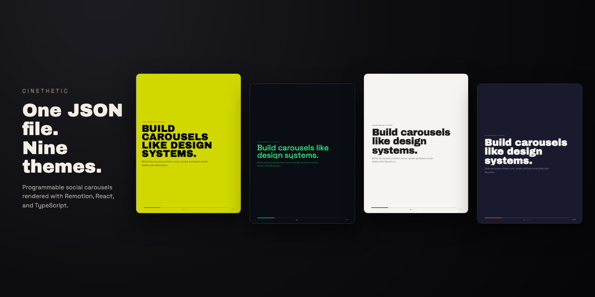

Write your carousel once as structured JSON, then render it through any theme. Typography, color, spacing, pagination, and export stay consistent across the whole deck — switch the theme registration and every slide follows.

<p align="center">
  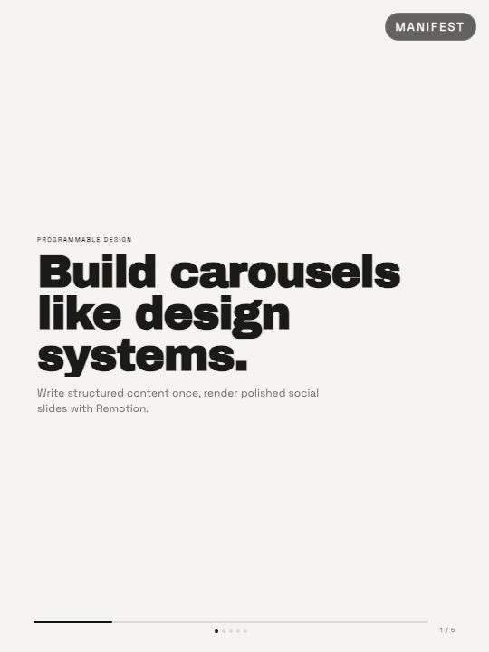
</p>
<p align="center"><em>The exact same slide data, cycling through all nine themes.</em></p>

## Theme Gallery

Every preview below renders the **same** `carousel-content.json`.

| Manifest | Terminal | Gazette |
| --- | --- | --- |
| 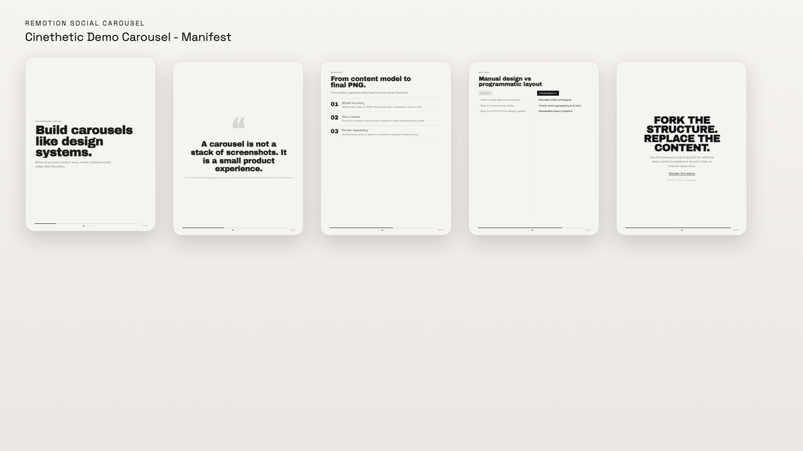 | 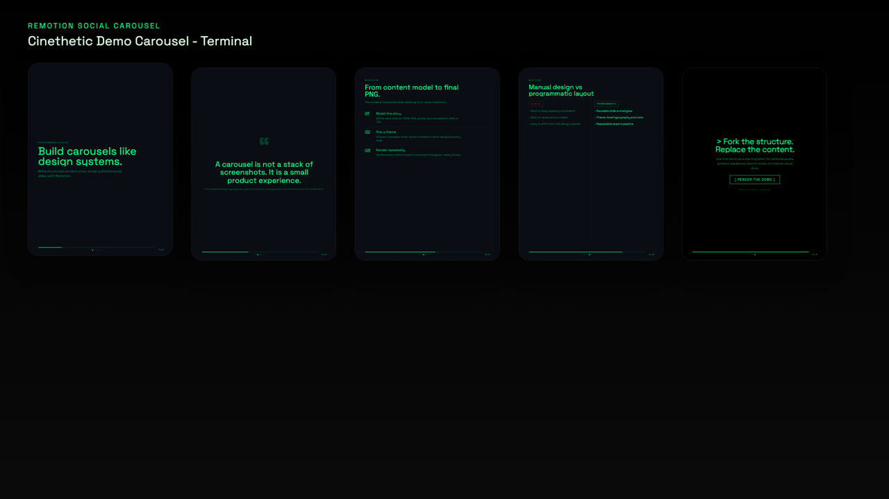 | 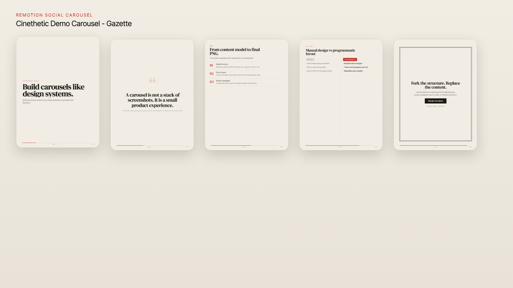 |

| Blueprint | Polaroid | Brutalist |
| --- | --- | --- |
| 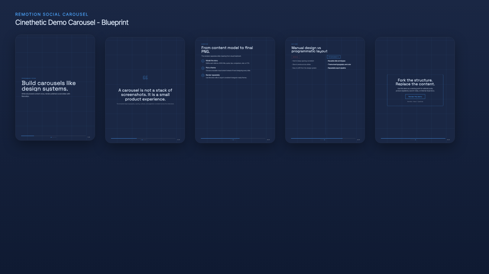 | 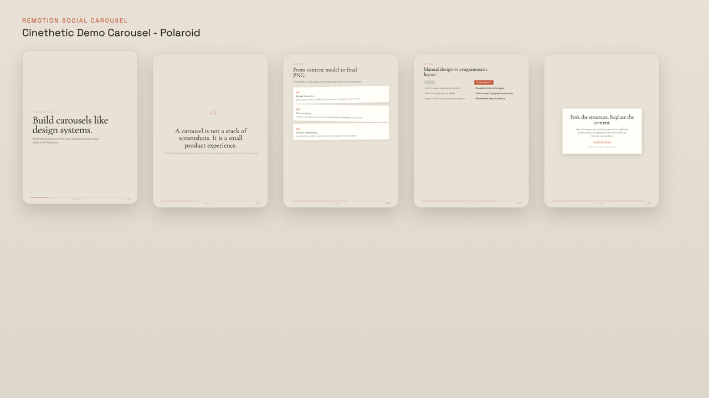 | 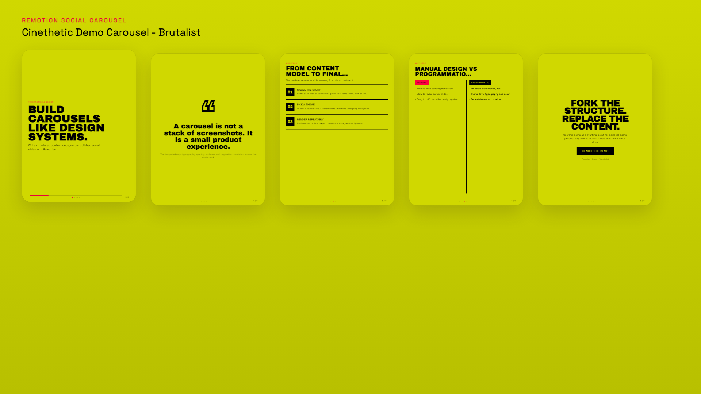 |

| Vapor | Redact | Neoprint |
| --- | --- | --- |
| 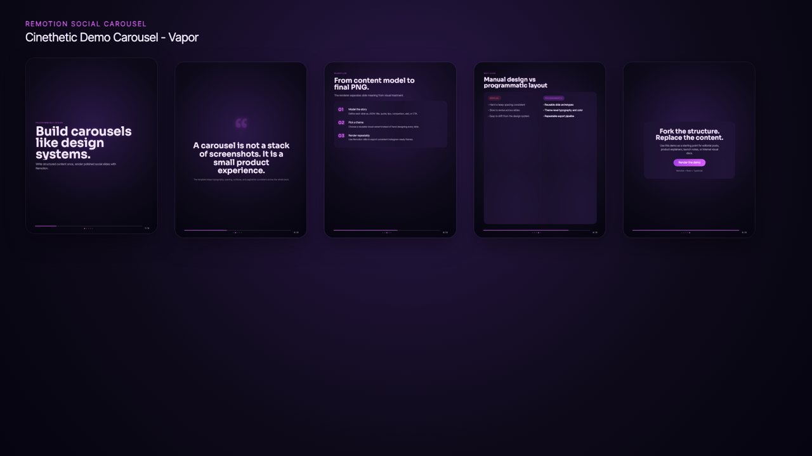 | 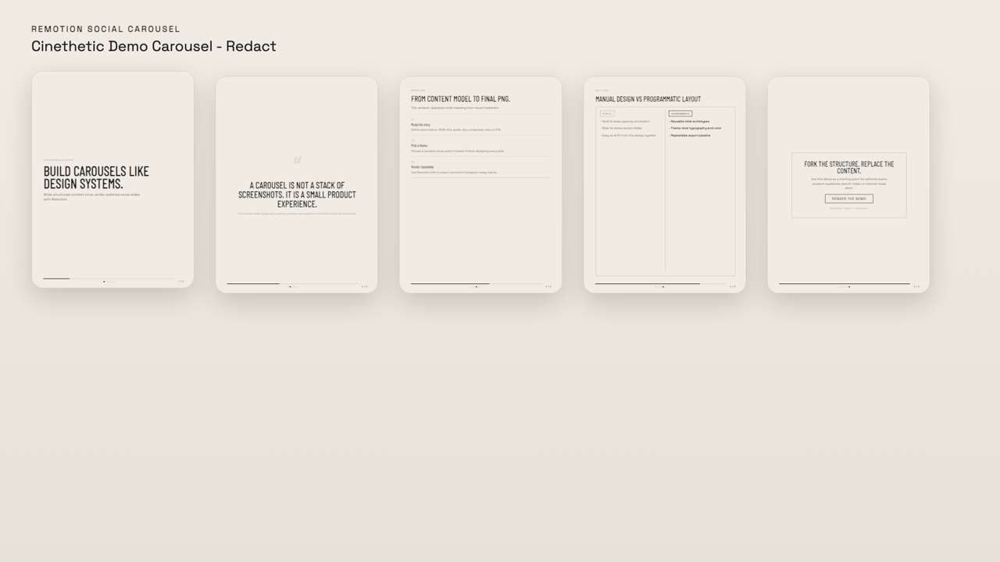 | 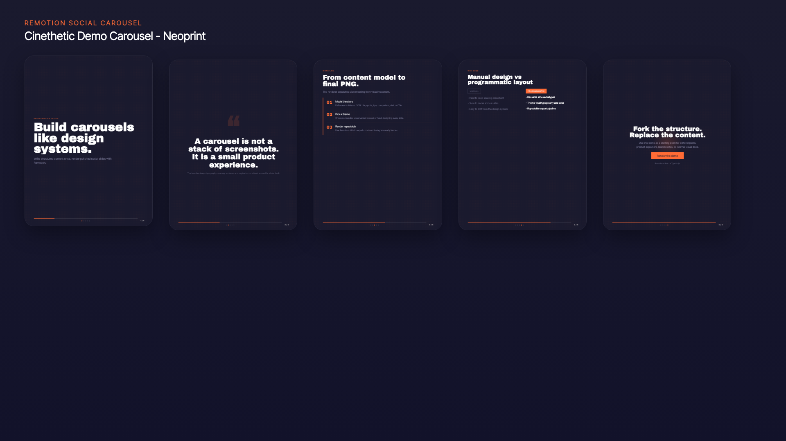 |

Each theme is a small typed object in [`src/theme.ts`](src/theme.ts):

| Theme | Personality |
| --- | --- |
| `manifestTheme` | Warm paper, hard black display type |
| `terminalTheme` | Phosphor green on black, monospace |
| `gazetteTheme` | Newsprint serif with a red accent |
| `blueprintTheme` | Technical blue with a drafting grid |
| `polaroidTheme` | Cream garamond, snapshot framing |
| `brutalistTheme` | Acid yellow, shouting headlines |
| `vaporTheme` | Deep purple, magenta glow |
| `redactTheme` | Monochrome dossier, condensed caps |
| `neoprintTheme` | Dark navy, orange halftone print |

## Up Close

Slides render at full social resolution (1080×1440). A few close-ups:

<p align="center">
  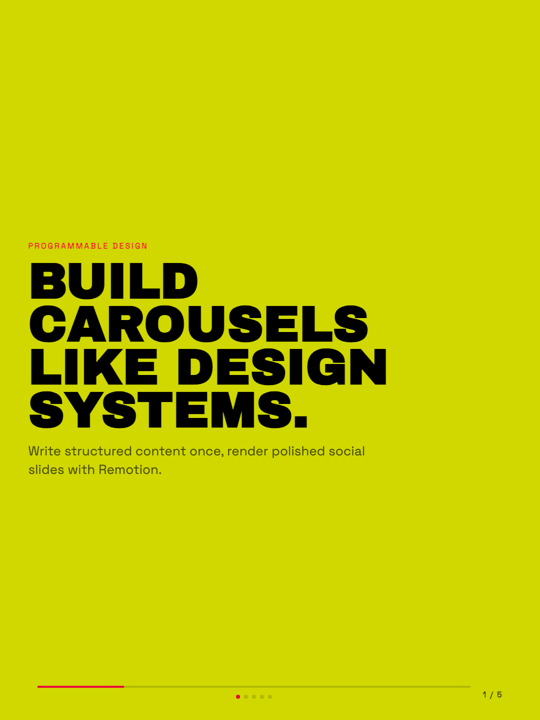
  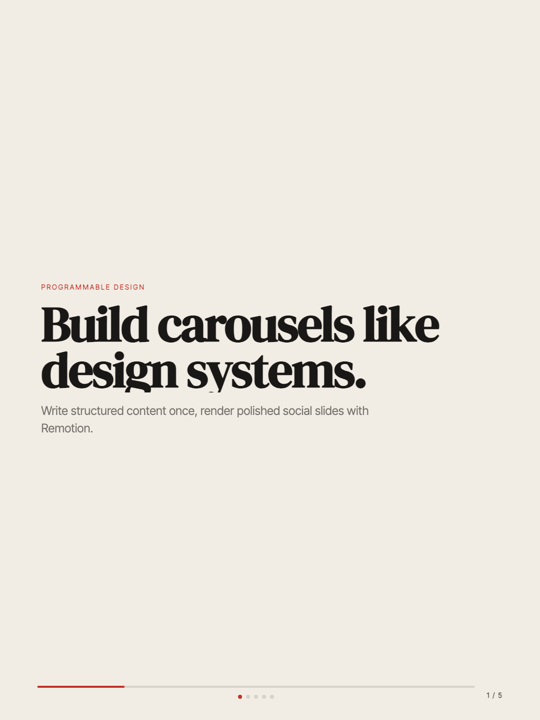
  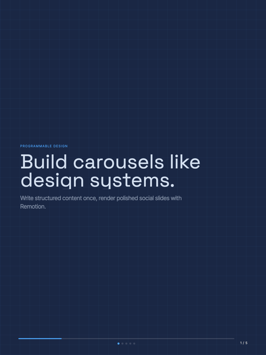
  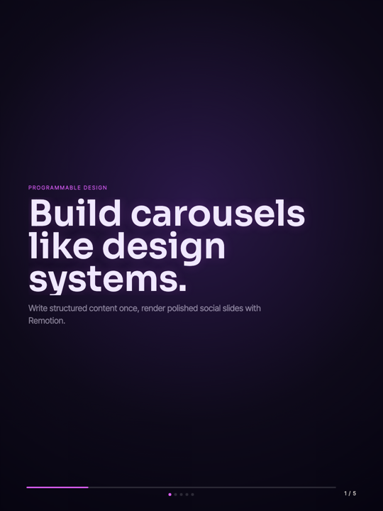
</p>

And one full deck (Manifest) showing the slide types used by the demo — title, quote, tips, compare, and CTA:

<p align="center">
  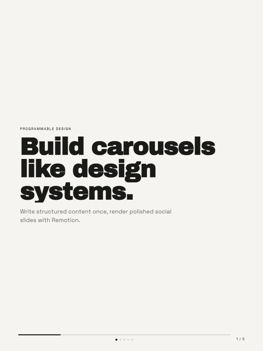
  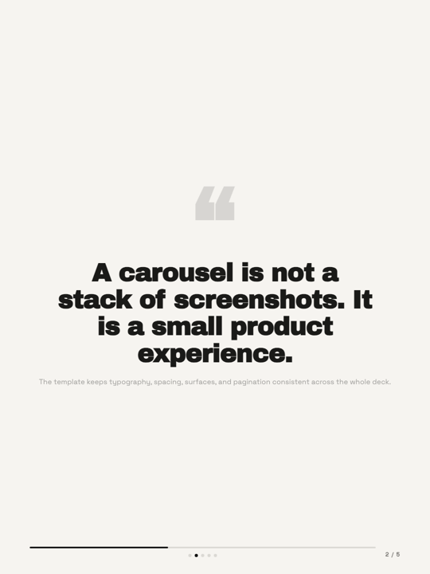
  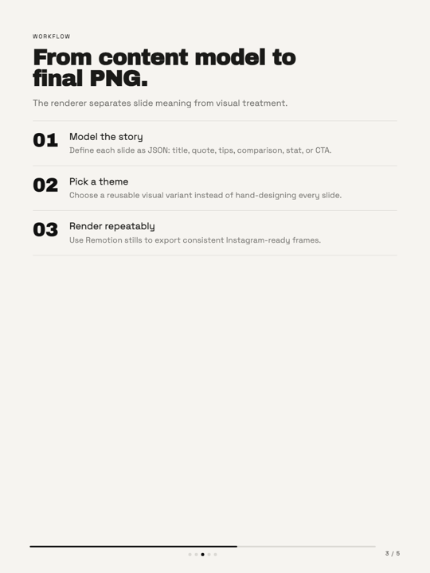
  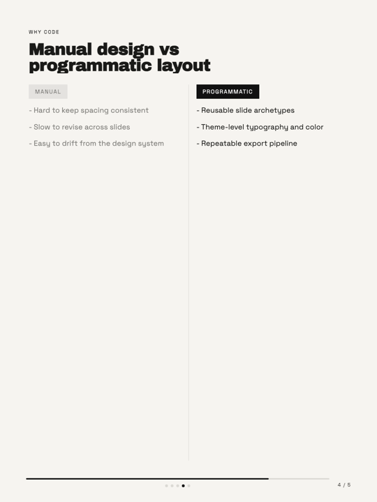
  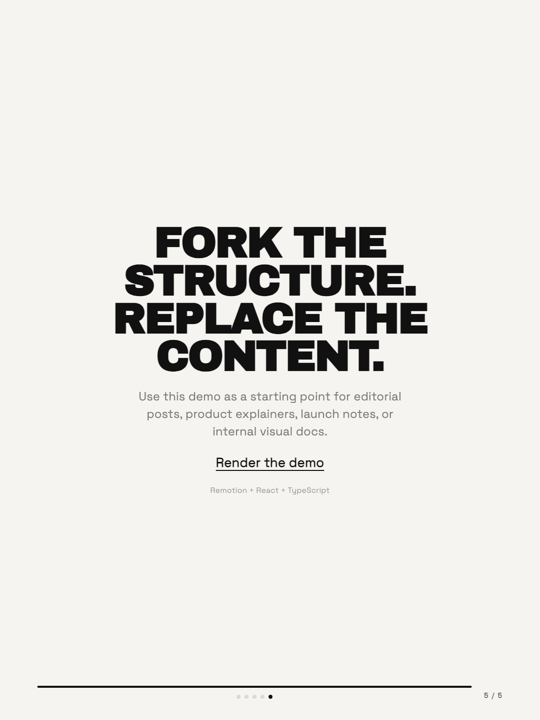
</p>

## Quick Start

Requires Node.js 22 or newer.

```bash
git clone https://github.com/aldoprianandi/cinethetic.git
cd cinethetic
npm install
npm run dev        # open Remotion Studio and browse every theme
```

Render the full demo (all nine themes, every slide plus a preview board):

```bash
npm run render:demo
```

Render a single theme:

```bash
node scripts/render-demo.mjs brutalist
```

Rendered files are written to `out/` (git-ignored):

```text
out/demo/
  brutalist/
    preview.png
    slides/slide-01.png ... slide-05.png
  manifest/
  terminal/
  ...
```

## How It Works

```text
carousel-content.json       what the slides say (typed slide data)
        │  validated by src/data/validateCarouselContent.ts
        │
src/data/demo-variants.json which themes are registered for the demo
        │
src/theme.ts                how it looks (canvas, color, type, spacing)
        │
src/compositions/           how it renders
  carousel/
    slides/                 one module per slide type (title, quote, tips, ...)
    variants.ts             per-theme layout flags
    palettes.ts             placeholder image palettes
    Carousel.tsx            slide dispatcher + preview board
        │
remotion still              deterministic PNG export
```

Slide content is data, not design. The demo deck uses five slide types (`text-title`, `text-quote`, `text-tips`, `text-compare`, `story-cta`); the renderer supports thirteen, all defined in [`src/types.ts`](src/types.ts) — including `cover`, `story-steps`, `text-stat`, and image-backed types. A data contract check (`npm run check:data`) validates every content file before render.

## Make It Yours

The 60-second version — the full recipe lives in [`docs/CUSTOMIZATION.md`](docs/CUSTOMIZATION.md).

**1. Change what the slides say.** Edit
[`src/data/posts/demo-carousel/carousel-content.json`](src/data/posts/demo-carousel/carousel-content.json)
and keep the `type` fields valid. Then run `npm run check:data`.

**2. Change how they look.** Demo registrations live in
[`src/data/demo-variants.json`](src/data/demo-variants.json) — each entry pairs a
theme export with a variant name:

```json
{
  "name": "gazette",
  "displayName": "Gazette",
  "variant": "gazette",
  "theme": "gazetteTheme",
  "compositionPrefix": "DemoGazette",
  "public": true
}
```

**3. Export.**

```bash
npx remotion still src/index.ts DemoGazetteSlide out/my-slide.png --props='{"slideIndex": 0}'
```

To add a whole new theme: add a theme object in `src/theme.ts`, a variant name in `src/types.ts`, an entry in `src/data/demo-variants.json` (plus the allowlists in `scripts/check-data.mjs`), and theme-specific layout tweaks via the flags in `src/compositions/carousel/variants.ts`.

## Commands

| Command | What it does |
| --- | --- |
| `npm run dev` | Remotion Studio with every composition |
| `npm run render:demo` | Render all themes (or pass one: `-- terminal`) |
| `npm run render:reel` | Render the animated theme reel GIF |
| `npm run render:hero` | Render the hero banner |
| `npm run check:data` | Validate carousel content and theme registrations |
| `npm run test:data` | Run the data-validation tests |
| `npm run typecheck` | TypeScript check |
| `npm run check:public` | Scan tracked files for unsafe content |
| `npm run verify` | Full pre-publish check (safety, data, types, compositions, render, audit) |

## Scope

This is a renderer demo, not a production content engine. It deliberately excludes content operations, brand assets, schedulers, and platform upload logic. Security and public-safety notes live in [`SECURITY.md`](SECURITY.md).

## License

[MIT](LICENSE)
